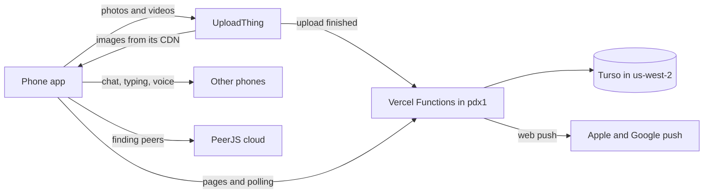

On September 24, the Dubsado team spent the day at Disneyland. Two days earlier, the app we used that day didn't exist.

It was a private, installable web app with four tabs: a **timeline** of photo and video posts, a **park map** showing where each post was taken and where people had been, a **group chat**, and **voice rooms** with push-to-talk. Only `@dubsado.com` Google accounts could get in.

It's crazy, because when someone asked me at Disneyland how long this app took to build, I said "5 hours." Looking back at it now, it's clear it took almost exactly double that. I guess time flies when you're having fun. But even in retrospect, when you have ADHD, your sense of time is unfaithful and untethered from reality.

This post covers how it was built, what it ran on, what people actually used, and what it cost. On the day itself there were 70 posts, 569 likes, and 1,369 location pings, and Vercel usage came to **$0.19**.

All times below are Pacific.

## The ask

The first Claude Code session started at 10:57am on Tuesday, September 22, with this prompt (trimmed):

> create a react router project as a framework (latest version). begin planning a simple photo and video sharing and video app that let's our company share photos from their day at disney land. it would be cool if we allowed for background app refresh (i think that only works on PWA version) that would track their location in our app "real time". when uploading files it should require them to stay on the page until fully updated. there should be a timeline view, but also a map view which lets you see where people have posted through the day. we will use UploadThing to host the files.

Everything in that prompt got built except background location tracking, which a web app can't do.

## The timeline

The whole build fits in about 30 hours of calendar time, including a night's sleep, but only 10 hours and 38 minutes of that was actual work. It ran across 14 Claude Code sessions, often three at once, with about 100 prompts. Most prompts were a single sentence ("I would like to be able to delete my own posts") or a screenshot of something broken on my phone.

Here it is split into sprints. A sprint is a stretch of activity in Claude Code with no gap longer than 45 minutes, so time spent testing on my phone between prompts counts, and parallel sessions only count once. Every commit is from the git history.

```timeline
# Tuesday, September 22
## 10:57am – 1:46pm
12:33pm | **First commit.** Clerk sign-in, UploadThing uploads, Turso and Drizzle, the timeline and composer, and a georeferenced park map with trails and a time scrubber. About 11,400 lines, not counting the lockfile.
12:53pm | Vercel preview deployments, the full-size logo, and the favicon
12:57pm | Keep `.env.example` in git despite Vercel's `.env*` ignore rule
1:39pm | Team chat over PeerJS, and a live timeline feed
1:46pm | Log UploadThing callbacks that get rejected
## 2:43pm – 3:58pm
3:24pm | Voice rooms, photo carousels, deleting posts, a paged timeline, push notifications, and the install sheet
3:29pm | Fix the browser build: a constant was imported from a `.server` module
## 5:51pm – 6:26pm
5:53pm | Log the shape of rejected UploadThing callbacks
6:00pm | Fix UploadThing callbacks rejected on Vercel (see below)
6:20pm | Likes, comments, and a page for each post
6:23pm | Show every post on the timeline, and filter by area only on the map
6:26pm | Fix the slug that arrived encoded inside the callback URL

# Wednesday, September 23
## 9:20am – 10:01am
9:37am | A Disney-style castle icon, drawn as a vector so it's sharp at every size
9:55am | A TURN relay (Metered) for phones on cell networks
## 11:54am – 5:12pm
12:35pm | Only `dubsado.com` accounts, checked on every request
1:54pm | Pull to refresh, a typing indicator, and location on by default
2:30pm | One app-wide peer-to-peer mesh, with a "who's online" list
2:48pm | Separate notification switches for chat, new rooms, and new posts
* 3:23pm | Write the announcement for the team, with install steps
3:54pm | Smaller copies of photos and video frames for the timeline and map
5:04pm | Chat reactions and Slack-style threads
5:09pm | Move the functions next to the database (see below)
5:10pm | Fix the thread view crashing

# Thursday, September 24 | Event day
## 5:44am – 5:56am
5:53am | Fix: tapping a notification on iOS lands on the right page

# Friday, September 25
## 7:03am – 7:05am
7:05am | Fix: post alerts open the post instead of "Post not found"
```

The first post of the day came in at 6:39am, 46 minutes after that morning's fix.

Most of the waiting was on things I couldn't test at my desk: uploads from a real phone, environment variables that hadn't reached the preview deployment, Vercel's Deployment Protection blocking a callback, Clerk's production domain failing to load its script, and a sign-in redirect loop in Chrome on my phone.

## The architecture

This is the same stack I wrote about in [My Stack and Why You Need One](/blog/my-stack-and-why-you-need-one), plus a few pieces for the realtime parts:

| Concern | Choice |
|---|---|
| Framework | React Router v8 (framework mode, server rendering) |
| Hosting | Vercel Functions, pinned to `pdx1` |
| Database | Turso (libSQL) in `us-west-2`, through Drizzle |
| Files | UploadThing, straight from the phone |
| Sign-in | Clerk, Google only |
| Map | Leaflet with the park map image placed over real coordinates |
| Chat, typing, voice | PeerJS (WebRTC), with a Metered TURN relay |
| Notifications | Web Push from a service worker |



### Files never touch our server

The phone uploads each file straight to UploadThing as soon as it's picked, before the person taps Post. UploadThing then calls our server to say the file landed, and we save a draft row. Tapping Post moves the drafts into `posts` under one shared group id, which the timeline shows as a carousel. Drafts nobody posts get swept after a day.

The phone also makes two smaller JPEGs of each photo before uploading: a 1280px copy for the timeline and a 400px copy for map pins. For a video, both are its frame at 3 seconds, used as a poster, so no video downloads until someone taps play. The original stays full size for downloads.

That's the main reason the Vercel bill is so small: our functions handle requests and JSON, never photo or video bytes.

### "Realtime" is polling, with a peer-to-peer shortcut

There's no WebSocket server. Every screen polls: the timeline asks for changes since its newest post, and the chat asks for messages since its last one. That's the source of truth, and it works everywhere.

On top of that, every open tab joins a PeerJS mesh with every other open tab. A `presence` table in the database is the directory (who's online, and their peer id), refreshed by a heartbeat. Chat messages go out over the mesh for instant delivery and get saved to the database. Message ids come from the sender, so the mesh copy, the polled copy, and the optimistic copy all dedupe by id. When WebRTC fails, which it does on some cell networks, the chat polls every 3 seconds instead of every 15.

### Location only works while the app is open

The first prompt asked for background location tracking. A web app can't do it. iOS suspends the page as soon as the screen locks, and Android Chrome stops `watchPosition` when the tab is hidden. The only real fix is a native app.

So the app shares location while it's open: a ping when you've moved 40 meters or a minute has passed, never more often than every 10 seconds. Failed pings queue in `localStorage` and send when the app comes back. Each post also tries to carry a location, from the photo's EXIF GPS when it has one, or the phone's position when it doesn't. The map shows "last seen" times so stale positions are obvious.

To draw trails, the server keeps one point per person per 3 minutes, in a single query:

```sql
SELECT user_id, lat, lng, recorded_at FROM (
  SELECT user_id, lat, lng, recorded_at,
         ROW_NUMBER() OVER (
           PARTITION BY user_id, CAST(recorded_at / 180000 AS INTEGER)
           ORDER BY recorded_at DESC
         ) AS rn
  FROM location_pings
  WHERE recorded_at >= ?
    AND lat BETWEEN ? AND ? AND lng BETWEEN ? AND ?
)
WHERE rn = 1
ORDER BY user_id, recorded_at
```

### A park map you can test from Glendale

The park map is an illustrated image, not map tiles. To place it over real coordinates, we matched four roads around the edge (Ball Road, Katella Avenue, Walnut Street, and Harbor Boulevard) to their pixel positions. Both axes came out at about 0.86 meters per pixel, which confirmed the image is north-up and undistorted.

In development, the map switches to a box the same size around our office in Glendale, so posting and location sharing can be tested on a walk around the block. A `/calibrate` page lays the park image over OpenStreetMap with an opacity slider, and lets you set a fake location to test from a desk.

## The gotchas that cost real time

**UploadThing's callback behind Vercel's Deployment Protection.** On preview deployments, Vercel blocked UploadThing's "upload finished" call to our server, so uploads succeeded but posts never saved. The fix is to put Vercel's bypass secret in the callback URL. But UploadThing appends `?slug=…` to the callback URL even when it already has a query string, and the slug ended up inside the bypass token. It took three commits and some logging to find. The final fix ends the URL with an empty parameter to absorb the append, then splits the slug back out when the request arrives:

```typescript
url.searchParams.set("x-vercel-protection-bypass", bypass);
// UploadThing adds "?slug=…" even when the URL already has a query.
// This trailing empty param absorbs it; the handler splits it back out.
return `${url.toString()}&_=`;
```

**Functions on the wrong coast.** Vercel ran our functions in `iad1` (Washington, D.C.), and Turso was in `us-west-2` (Oregon), so every query crossed the country. Tab switches felt slow. One line in `vercel.json` fixed it:

```json
{ "regions": ["pdx1"] }
```

**`drizzle-kit push` wanted to delete every user.** Adding a column with `.notNull().default(false)` to a table with rows made Drizzle plan `delete from users` so it could add the column. The notification switches are nullable instead, and `null` means "use the default".

**Things that never finish in a hidden tab.** `img.decode()` and `requestAnimationFrame` never settle when the tab isn't visible, so making the smaller copies could hang in a background tab. Waiting on `load` events instead fixed it.

**Push notifications on iOS.** Push only works once the app is added to the home screen, and iOS only lets a tap ask for permission. So the app shows a sheet with a button as soon as someone arrives, after the Add to Home Screen sheet if that's showing. Even then, iOS sometimes opens the app at `/` instead of the notification's page. The fix that went out at 5:53am on the day stores the tapped URL in the service worker's cache, and the app checks for it whenever it's shown.

## The day, by the numbers

Preview and production shared one database, so the rows from the 22nd and 23rd are mostly testing. These are the numbers for the 24th:

| | Sep 24 |
|---|---|
| People signed in (all time) | 27 |
| Posts (files) | 70 (83) |
| People who posted | 21 |
| Likes | 569 |
| Comments | 74 |
| Chat messages | 31, including 20 thread replies |
| Chat reactions | 43 |
| Location pings | 1,369 from 22 people |
| Voice rooms started | 0 |

And in three-hour windows, with location pings, how many people shared their location during each window, and chat messages:

| Time | Posts | Pings | Sharing | Chat |
|---|---|---|---|---|
| 3am to 6am | 0 | 15 | 2 | 0 |
| 6am to 9am | 7 | 197 | 12 | 2 |
| 9am to noon | 20 | 421 | 18 | 15 |
| Noon to 3pm | 19 | 316 | 17 | 9 |
| 3pm to 6pm | 12 | 148 | 17 | 0 |
| 6pm to 9pm | 9 | 180 | 18 | 5 |
| 9pm to midnight | 3 | 92 | 12 | 0 |

- **Likes were the most-used feature by far.** Every post in the app, 76 in all, got at least one like, and one got 13.
- **Chat was quiet, but threads got used.** Threads shipped the night before, and 20 of the day's 31 messages were thread replies.
- **Nobody opened a voice room.** Four rooms were created, all during testing. Voice was the most complex feature in the app (a WebRTC mesh, a TURN relay, push-to-talk). Our guess is that people at a theme park together just talk to each other.
- **Two-thirds of location pings were on the map.** 916 of the 1,369 fell inside the map's area, which covers both parks, Downtown Disney, and the resort hotels. The rest were drives in, other hotels, and trips home.
- **Most photos didn't carry their own GPS.** Of all 89 files, 36 got their location from EXIF, 48 from the phone's position, and 5 had none. iOS strips GPS from photos picked through the browser unless the person turns it on, so the fallback mattered.
- **Getting people installed early worked.** 17 people signed in the day before, most of them in the hours after the announcement went out. 21 of the 27 turned on push notifications.

### Uploaded files

The database has 89 published files, but UploadThing has 280. Each photo becomes three files (the original, the 1280px copy, and the 400px copy), and the rest are test uploads from the build days. 249 of the 280 were uploaded on the 24th.

| Type | Files | Size |
|---|---|---|
| Photos and smaller copies (JPEG, PNG) | 269 | 316 MB |
| Videos (MOV, MP4) | 7 | 295 MB |
| **Total stored** | **276** | **611 MB** |

The other four files are videos that never finished uploading. All four stalled mid-afternoon, which is when the park is busiest and the cell network is at its worst. Three were retried a minute or two later and went through. One 109 MB video never made it. Resumable uploads were on the to-do list from the first plan, and they would have saved that one.

To get these numbers, UploadThing's server SDK has two helpful calls:

```typescript
const utapi = new UTApi();
await utapi.getUsageInfo(); // { filesUploaded, appTotalBytes, limitBytes, ... }
await utapi.listFiles({ limit: 500 }); // each file's name, size, status, uploadedAt
```

## What it cost

Vercel's usage page for the project, September 22 to 25:

| Product | Usage | Charge |
|---|---|---|
| Fluid Active CPU | 1 hour | $0.15 |
| Fluid Provisioned Memory | 7.37 GB-hours | $0.08 |
| Build CPU | 2 hours | $0.07 |
| Function Invocations | 47,130 | $0.03 |
| Fast Origin Transfer | 198 MB | $0.01 |
| CDN Requests | 53,600 of 10M included | $0.00 |
| Fast Data Transfer | 392 MB of 1 TB included | $0.00 |
| **Total** | | **$0.33** |

By day, that was $0.01 on the 22nd, $0.11 on the 23rd, **$0.19 on the 24th**, and $0.03 on the 25th. The 24th breaks down to $0.11 of CPU, $0.05 of memory, $0.02 of invocations, and $0.01 of origin transfer.

The Vercel CLI gives the same numbers, which is handy when you want them per day or per project:

```bash
npx vercel usage --from 2026-09-22 --to 2026-09-28 --group-by project
npx vercel usage --from 2026-09-24 --to 2026-09-24 --group-by project --json
```

It was this cheap for two reasons.

**Media never went through Vercel.** On the 24th, Vercel sent out 243 MB in total: HTML, JavaScript, and JSON. The photos and videos, uploaded once and viewed over and over, all came from UploadThing's CDN.

**Polling was cheap because phones were in pockets.** The day had 33,800 function invocations. Spread over 22 people and about 17 hours, that's 33,800 ÷ 22 ÷ 17 ≈ 90 calls per person per hour, or one every 40 seconds. The app polls every 3 to 20 seconds while it's on screen, so on average each phone had the app open a small fraction of the time. The day's invocation charge was 2 cents.

The whole stack:

| Service | Used for | Cost for the event |
|---|---|---|
| Vercel | Pages, API, polling | $0.33 in usage, on the Pro plan I already had |
| UploadThing | File storage and CDN | $10/month for the 100 GB plan, though the free plan covers up to 2 GB and we stayed under 1 GB |
| Turso | Database | $0 expected: the whole database is 780 KB, and the free tier allows 5 GB and 500 million row reads a month |
| Clerk | Google sign-in | $0: 27 users, and the free tier covers 50,000 |
| PeerJS | Finding peers for WebRTC | $0: the public signalling server |
| Metered | TURN relay | $0 expected: the free tier is 500 MB a month, and nobody used voice |
| Web Push | Notifications | $0 |

About $10.33 in all, and $10 of that was a storage plan the event turned out not to need. I'd still pay for it next time. The free 2 GB is shared across every app on the account, and a few people posting long 4K videos could have filled it by lunch.

## Wins

- **Testing the map from Glendale.** A fake location and a same-size map around our office meant most of the map got tested without anyone driving to Anaheim. On the day, 916 location pings landed inside the park map's area.
- **A preview environment separate from production.** Building on Vercel's preview deployments meant I didn't have to set up DNS before anything else could work, and that got the app off the ground faster. It did cost a few hours at the finish line.

## What I learned

- **Build what people do in a park.** Likes (569) beat comments (74), which beat chat (31), which beat voice (0). Voice rooms pulled in a TURN relay and much of the mesh work, and nobody used them. That time would have been better spent on resumable video uploads.
- **Put your functions next to your database.** Vercel's default region is on the other side of the country from Oregon. One line of config made every page faster.
- **Web apps can't track location in the background.** Foreground sharing, a queue for failed pings, and the location on each post still drew a useful map of the day.
- **Set up production alongside the preview deployment.** I left production and its DNS for the end. I wanted to launch before I left for work on Wednesday, but DNS propagation errors held it up, so the announcement had to wait until I got home. Setting up production in parallel would have given DNS time to settle.

---

*Note from the author: This post was entirely created by AI, from the project's git history, its database, and Vercel's usage data. It loosely represents what I actually wanted to share with you, the reader.*
