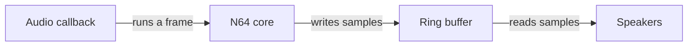

*Part 3 of 4. Previous: [Part 1: When the Compiler Said No](/blog/building-n64-emulator-webassembly) · [Part 2: Three Files and a Title Screen](/blog/building-n64-emulator-webassembly-part-2) · Next: [Part 4: The Crash We Couldn't Reproduce and the Keys We Never Mapped](/blog/building-n64-emulator-webassembly-part-4)*

By the end of [Part 2](/blog/building-n64-emulator-webassembly-part-2), *Off Road Challenge* was rendering in the browser. This part covers audio, which we mostly solved, and keyboard input, which we didn't.

## Let the audio drive the frames

Browser emulation runs on two clocks. The emulator produces audio samples at the game's pace, and the browser asks for samples at the sound card's pace. When they drift apart, you get crackles, pops, or silence.

The obvious approach is to run one emulator frame per display frame:

```javascript
// Drifts out of sync with the audio hardware
function gameLoop() {
  Module._runMainLoop();
  requestAnimationFrame(gameLoop);
}
```

`requestAnimationFrame` follows the monitor's refresh rate. The audio callback follows buffer sizes and the sample rate. The two drift, the audio buffer runs dry, and you hear it.

The fix was to flip it around: **run emulator frames from inside the audio callback.** When the browser asks for sound, we run a frame, which produces that sound. Audio becomes the clock, and sound and picture can't drift apart because audio drives both.



Between the emulator and the speakers sits a ring buffer: a circular array of 64,000 samples with a write position (the emulator) and a read position (the speakers). Both wrap back to zero at the end, and the gap between them is how much audio is queued. Here's the callback, simplified:

```typescript
private onAudioProcess(event: AudioProcessingEvent): void {
  const left = event.outputBuffer.getChannelData(0);
  const right = event.outputBuffer.getChannelData(1);

  // Running low? Run extra frames to refill the buffer
  let available = this.writePos - this.readPos;
  if (available < 0) available += RING_BUFFER_SIZE;
  if (available / RING_BUFFER_SIZE < 0.3) {
    this.module._runMainLoop();
    this.module._runMainLoop();
  }

  // The key idea: one emulator frame per audio callback
  this.module._runMainLoop();

  for (let i = 0; i < left.length; i++) {
    if (this.readPos === this.writePos) {
      left[i] = right[i] = 0; // Underrun: play silence
      continue;
    }
    left[i] = softClip(this.buffer[this.readPos] / 32768);
    right[i] = softClip(this.buffer[this.readPos + 1] / 32768);
    this.readPos = (this.readPos + 2) % RING_BUFFER_SIZE;
  }
}
```

That `softClip` handles loud peaks. Clamping samples to ±1 squares off the waveform and sounds harsh. Running anything near the limit through `tanh` rounds it off instead, the way analog tape saturates:

```typescript
const softClip = (x: number) => (Math.abs(x) > 0.95 ? Math.tanh(x * 0.9) : x);
```

A dynamics compressor after the callback evens out sudden volume spikes.

## Good, not perfect

This got rid of the harsh crackling we started with, and most of the time the sound is smooth. But every so often the audio still **skips**, and it's jarring when it does.

We tried bigger buffers (fewer skips, more latency), extra frames when the buffer runs low, gentler back-off after repeated underruns, and other sample rates and buffer sizes. Each helped a little, and none fixed it. Our best guesses are timing edge cases in the buffer, browser tab throttling, and occasional drift between the frame rate and the callback rate.

It's fine for casual play, but not yet for pristine audio.

## The input problem we never solved

Emscripten supports SDL, the standard library for game input, and we had a canvas. Keyboard input should have just worked.

It didn't, at least not reliably. Key events showed up in JavaScript, but whether they reached the emulator was hit or miss, and we still don't know why. Here's everything we tried:

| Attempt | Result |
|---|---|
| Make the canvas focusable (`tabindex="0"`) and focus it | Events reach JavaScript. Unclear past that. |
| Point SDL at the canvas with `SDL_EMSCRIPTEN_KEYBOARD_ELEMENT` | No visible change |
| Map keys to SDL scancodes and push them into `SDL.events` | Events created. Unclear if processed. |
| Call `SDL_PushEvent` from JavaScript | May not be exported, or the event shape is wrong |
| Load N64Wasm's proven `input_controller.js` | Loads, but untested in real gameplay |

The open questions: are events reaching the WebAssembly module at all? Is SDL set up for the keyboard? Does ParaLLEl expect a different input path? Are we missing a setup step?

We're publishing the dead ends on purpose. If we crack it later, we'll know what we already tried. If you hit the same wall, you're not alone. And if you've solved it, please [open a PR](https://github.com/wayjake/web64).

## Where it stands

- **Loads in about 2 seconds** and uses about 200 MB of memory, with a core of roughly 2 MB
- **Renders** *Off Road Challenge* in WebGL2
- **Audio** is usable, with occasional skips
- **Input** partly works
- **Saves** aren't built yet. The plan is Emscripten's IDBFS, which mounts IndexedDB as a folder the emulator can write to.

Next up: fix the audio skips, fix input, add saves, and finish a full race. After that come browser testing, gamepads, save states, and CRT shaders.

## What the whole project taught us

The compiler crash cost us a day instead of weeks because we stopped fighting it. N64Wasm's code answered questions no documentation did. The audio callback turned out to be the most reliable clock in the browser. And partial success is still progress: it runs, it renders, and it makes sound.

Real WebAssembly projects are messy. They need pivots, and they don't always work on the first try, or the fifth. That's the process, not a sign you're doing it wrong.

## Resources

- [web64 on GitHub](https://github.com/wayjake/web64): our project
- [N64Wasm](https://github.com/jmallyhakker/N64Wasm): the pre-compiled core that made this possible ([demo](https://jmallyhakker.github.io/N64Wasm/))
- [ParaLLEl N64](https://github.com/libretro/parallel-n64): the emulator core itself

Special thanks to jmallyhakker for the N64Wasm project. This series documents web64 as of October 2025.

**Happy emulating!**

---

*Note from the author: This series was entirely created by AI. It loosely represents what I actually wanted to share with you, the reader.*
