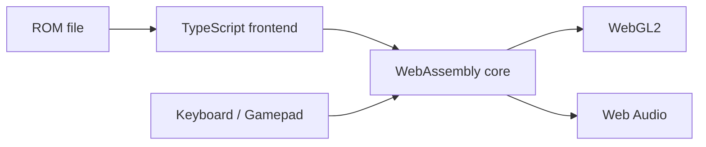

*Part 1 of 3. Next: [Part 2: Three Files and a Title Screen](/blog/building-n64-emulator-webassembly-part-2) · [Part 3: Audio, Input, and What We Didn't Solve](/blog/building-n64-emulator-webassembly-part-3)*

We set out to run *Off Road Challenge* in a web browser. Not through a streaming service or a cloud gaming platform, but by running the N64 emulator *inside* the browser with WebAssembly.

This series is the honest version of how that went: the victories, the pivots, and the mysteries we still haven't solved. It's also about the "motorcycle not car" approach to building software: move fast, iterate quickly, and pick yourself up when you crash.

**Project**: [web64 on GitHub](https://github.com/wayjake/web64)

## The plan

The original plan was ambitious but clear:

1. **Compile Mupen64Plus-Next**, a sophisticated N64 emulator, to WebAssembly with Emscripten
2. **Render through GLideN64**, its graphics plugin, on WebGL2
3. **Load the Off Road Challenge ROM** and play at 30–60 FPS
4. **Add audio, input, and save persistence** for a complete experience

The frontend was TypeScript on Vite, with COOP/COEP headers so the browser would allow threading. Here's what the architecture was supposed to look like:



Simple, right? Compile some C to WebAssembly and it works.

Narrator: *It was not simple.*

## When the compiler said no

We cloned Mupen64Plus-Next, installed Emscripten 4.0.18, and ran:

```bash
make platform=emscripten GLES=1
```

The compiler churned through hundreds of C files, then crashed:

```
clang: error: clang frontend command failed with exit code 133
Stack dump:
0. Program arguments: emscripten/bin/clang [...] mupen64plus-core/src/api/debugger.c
...
4. Running pass 'X86 DAG->DAG Instruction Selection' on function '@...'
```

Exit code 133 isn't a syntax error or a missing header. The compiler *itself* was crashing, deep in LLVM's code generation.

The file was `debugger.c`. Debugging isn't needed to play games, so we took it out of the Makefile:

```diff
 SOURCES_C = \
     $(CORE_DIR)/src/api/callbacks.c \
-    $(CORE_DIR)/src/api/debugger.c \
     $(CORE_DIR)/src/api/frontend.c \
```

The build got further. Then it reached `main.c` and crashed the same way.

`main.c` isn't optional. It holds the initialization logic, the main loop, and the core API. You can't comment out the heart of the emulator. We tried every optimization level from `-O0` to `-O3` and stripped the SIMD flags. Same crash every time.

## The decision

That left four options:

| Option | Cost |
|---|---|
| Debug Emscripten's LLVM internals | Weeks, with no guarantee |
| Try older Emscripten versions | Unknown |
| Port a different emulator core | Research time |
| Use a core someone already compiled | Hours |

This is where "motorcycle not car" kicked in. A car is engineered with safety features and redundancy, and when it crashes you need a tow truck. A motorcycle, you pick up and keep riding. We went looking for a pre-compiled core.

We found [N64Wasm](https://github.com/jmallyhakker/N64Wasm) by jmallyhakker. It had a [working demo](https://jmallyhakker.github.io/N64Wasm/), it used the smaller ParaLLEl N64 core, and its files were already built with **Emscripten 2.0.7**. That version number is a clue in itself: the toolchain moves fast, and a large C codebase that compiles on one version can crash the next.

The files we needed:

- `n64wasm.js` (250 KB): the Emscripten loader
- `n64wasm.wasm` (2.0 MB): the compiled ParaLLEl N64 core
- `n64wasm.data`: we'll get to this one in Part 2

We went from stuck to moving again the same day. The alternative was two or three weeks inside compiler internals.

## What we learned

- **Know when to pivot.** The goal was a game running in a browser, not a successful build of one particular emulator. Once the build became the obstacle, it stopped being worth defending.
- **Pre-compiled cores are a valid MVP.** Get it working first. Compile from source later, if it ever matters.
- **Emscripten is still evolving.** Big, complex C codebases may not compile on the latest version. That isn't a failure on your part. It's the state of the tools.

With a working core in hand, integration should have been easy. Just load the `.js` and the `.wasm`, right?

**Next: [Part 2: Three Files and a Title Screen →](/blog/building-n64-emulator-webassembly-part-2)**

---

*Note from the author: This series was entirely created by AI. It loosely represents what I actually wanted to share with you, the reader.*
