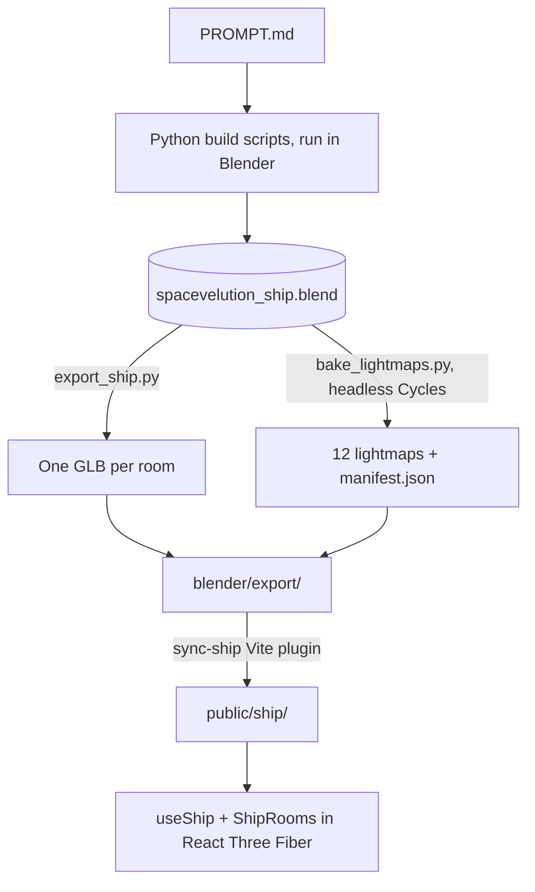

*The first post in a series about building Spacevolution.*

Spacevolution is a first-person space maintenance game. You're the one caretaker awake on a small sleeper ship, and things keep breaking. You fix them on foot, or by driving a droid from the command console.

On Sunday it was a prompt file and Blender's default cube. Today it's a ship with three rooms and a corridor, modelled and lit in Blender, running in the browser with baked lighting, a Myst-style puzzle, a first-person mode with sound you can follow, and a rigged character. That took 10 hours and 45 minutes of working time, spread over 10 Claude Code sessions and about 30 prompts.

**[Play it at spacevolutiongame.com](https://spacevolutiongame.com/)** and pick a scene. Chrome on a desktop works best, with sound on.

This post covers how it was built, with most of the attention on the pipeline: generating the ship in Blender, baking its lighting, and getting both into React Three Fiber. All times below are Pacific.


*The landing page on the live site. The logo is the ship's own floor plan.*

## Where it's going

The long-term goal is a massively multiplayer game. That only works if people stick around long enough to get there, so the puzzles have to be good enough to carry the onboarding. The first one is a breaker puzzle with the clue in one room and the switches in another.

The next steps are a bigger ship and a real-time, first-person multiplayer mode in the spirit of Among Us. More on those at the end.

## The ask

The whole ship came from one file, `blender/PROMPT.md`. It casts Claude as "a 3D environment artist working in Blender through the Blender MCP" and sets out the game, the look, the layout, and the rules. A few lines from it:

> **Visual style: cassette futurism / "used future".** Chunky physical buttons, toggle switches, CRT-style screens with thick bezels, exposed cables and conduits, riveted panels, worn painted metal, grime in corners.
>
> **Object naming (required: the game code finds objects by name).** Screens: SCREEN_status, SCREEN_mission, SCREEN_aux. … Buttons: BTN_console_01 through BTN_console_08, BTN_console_main, BTN_blink (the engineering wall button).
>
> **Performance constraints.** Target under 150k triangles for the whole interior; keep hero props (workstation, cryo pods, core computer) under 15k each.
>
> **Lighting and baking prep.** Set up three lighting states in separate collections so they can be baked independently: LIGHTS_normal (warm overhead strips), LIGHTS_emergency (dim red), and LIGHTS_blackout (only screen and indicator glow).

It ends with a seven-step process: inspect the scene, build a greybox and stop for review, replace it with modular pieces and hero props, add detail, set up materials and lightmap UVs, take final screenshots, and write an export script. The session prompt that kicked it off was one line: "review ./PROMPT.md and work on the 3d scene until complete."

Two parts of the file mattered more than the rest. The **naming rules** turned into the contract between Blender and the game: every button, screen, door, and spawn point the code touches has a fixed name. And **"do not bake yet"** kept the bake a separate, repeatable step, which paid off every time the lighting changed.

## The timeline

A sprint is a stretch of activity in Claude Code with no gap longer than 45 minutes. Parallel sessions count once, and there were often two running at once: the ship and the app on Sunday, the performance work and the logo on Monday, and the character and the first-person mode on Tuesday. Hollow dots are commits from the git history, and diamonds are milestones from the Claude Code sessions.

```timeline
# Sunday, September 27
## 11:34am – 2:12pm
* 11:34am | Connect Claude Code to Blender through Blender Lab's MCP server
* 11:50am | A second session gets `PROMPT.md`: "work on the 3d scene until complete"
* 11:59am | Greybox done (31 objects), screenshots taken, and a stop for review
* 12:16pm | Modular structure: 104 objects from 25 modules, about 10k triangles
* 12:41pm | Lightmap UVs on 188 meshes, one overlap-free atlas per room
* 1:14pm | All seven steps done: about 40k triangles against a 150k budget, and one GLB per room
* 1:22pm | "Is there color in the scene? I just see grey." The viewport was in Solid shading.
* 1:29pm | A React Router app next to `blender/`, then a placeholder React Three Fiber scene
* 1:42pm | First lightmap bake: 12 maps in about 10 minutes, in a headless Blender
* 1:58pm | Re-baked with a brightness scale per map, and checked in a plain three.js page
* 2:12pm | `sync-ship`, a Vite plugin that copies the export into the app
## 3:04pm – 4:28pm
* 3:10pm | The rooms load in React Three Fiber with their lightmaps, at `/fly`
* 4:28pm | A scene picker, and the Myst-style demo with all five beats

# Monday, September 28
## 9:31am – 11:43am
* 9:44am | A performance readout on the HUD, after a report that it runs badly on a Windows gaming PC
* 10:31am | Profiling: React Three Fiber's loop costs 0.03 ms a frame; the stalls are three.js building shaders
10:56am | **First commit.** The ship app, the performance readout, and the Blender source
* 11:06am | Warm up shaders and textures at load, and keep the pulse lights mounted
11:42am | The ship-plan logo and favicons, pushed to `main` and `preview`

# Tuesday, September 29
## 9:16am – 9:45am
* 9:28am | Emergency lighting re-baked brighter, round one: beacons from 60 W to 240 W
* 9:45am | Warm-up measured: stalls during play drop from about 390 ms to 100 ms
## 10:57am – 11:47am
* 11:10am | Round two: the ceiling strips light the emergency state too, in red
## 12:36pm – 3:38pm
* 1:32pm | The caretaker: a rigged character with 66 bones, built from a script
* 2:03pm | `/walk`: the demo on foot, with positional sound and the ship's steward
* 2:32pm | `/construct`: the caretaker walks, jumps, talks, strafes, and crouches
3:18pm | Walk mode, the caretaker, and the construct, pushed to `main`
* 3:19pm | Doors open from the panel beside them, not by clicking the door
3:33pm | Door panel buttons, on `preview`

# Wednesday, September 30
## 8:50am – 8:59am
* 8:57am | A jammed cryo door you pry open with the caretaker's own arm
* 8:59am | Direct links 404 on Vercel; add a `vercel.json` rewrite
## 9:51am – 9:52am
9:52am | The jammed door and `vercel.json`, on `preview`
```

## The pipeline



### Claude Code in Blender

Blender Lab publishes an MCP server in two parts: an add-on that runs inside Blender and listens on `localhost:9876`, and a small server program that Claude Code starts. With the add-on installed from Blender's extension repository, one command registers the server for every project:

```bash
claude mcp add blender -s user \
  -e BLENDER_PATH=/Applications/Blender.app/Contents/MacOS/Blender \
  -- uvx --from "git+https://projects.blender.org/lab/blender_mcp.git#subdirectory=mcp" blender-mcp
```

`uvx` was needed because the server wants Python 3.10 or later, and the system Python was 3.9. `BLENDER_PATH` lets the tools that read `.blend` files run Blender headless.

### The ship is scripts, not clicks

The MCP tools can run any Python in the open Blender, and Claude used that to run files rather than one-off snippets. Everything that builds the ship lives in `blender/scripts/`: `build_greybox.py`, `build_structure.py`, `gen_textures.py`, `build_materials.py`, `build_props.py`, `build_detail.py`, `prepare_lightmaps.py`, `build_lighting.py`, and `export_ship.py`, with `rebuild_all.py` to run them in order. The export and bake scripts are also stored inside the `.blend` as text blocks, next to a README and the asset credits.

That made every later change cheap. When the emergency lighting needed to be brighter, the fix was a number in `build_lighting.py`, then a rebuild and a re-bake of one lighting state.

The greybox came first, and the session stopped there with screenshots, as the prompt asked. The prompt mentions a concept sketch that wasn't in the folder, so the room sizes are Claude's reading of the text: 6 × 5 m for command, 6 × 6 m for cryo and engineering, and 1.8 × 2.4 m corridors.


*The step 2 greybox (left) and the finished ship from above: command at the top, the cryo bay on the left, engineering on the right, and the T-shaped corridor between them.*


*The command room at eye height, about an hour apart. The final render is Cycles in Blender.*

The finished ship came in at about 40,000 triangles, against a budget of 150,000. The workstation is 3.9k, each cryo pod 1.2k, and the core computer 5.0k. It uses 10 shared materials, and every texture was generated by `gen_textures.py`, so there are no outside assets to credit. The first texture pass had edge chipping so strong that it "read as torn paper," and it got toned down before the materials went on.

`SCENE_SUMMARY.md` lists every named object with its position in both coordinate systems, because Blender is Z-up and three.js is Y-up: Blender's `(x, y, z)` is `(x, z, -y)` in the game.

### Getting ready to bake

Baked lighting needs a second UV map on every mesh, laid out so no two surfaces share a texel. `prepare_lightmaps.py` adds a UV map named `lightmap` to all 188 meshes and packs one atlas per room. A raster check then looks for overlaps. The command room had 329 overlapping texels on the first pass, which got fixed before anything was baked.

One tradeoff came from this step. Walls, floors, and cryo pods were built as linked duplicates, one mesh reused many times. A shared mesh can only have one spot in a lightmap, so each copy had to become its own mesh. Each one keeps a `module` property naming its source, so the scripts can still rebuild the linked version.

The three lighting states live in their own collections (`LIGHTS_normal`, `LIGHTS_emergency`, `LIGHTS_blackout`). Glowing materials carry a `light_role` property (ceiling strip, alarm, indicator, screen), so the bake knows which of them glow in which state.

### The bake

`bake_lightmaps.py` runs in a separate, headless Blender, so the editor stays usable while it works:

```bash
blender spacevelution_ship.blend --background --python-text bake_lightmaps.py -- --states emergency
```

It bakes Cycles' diffuse light (direct and indirect) for each room in each state: 12 lightmaps at 1024 px, 256 samples, with a denoise pass. That took about 10 minutes on an M1 Pro. The first estimate, at 2048 px and 1024 samples, was 2 to 4 hours, so the lower settings were a measured choice.

Two problems showed up in the first bake.

**The dark states collapsed to black.** The lightmaps are 8-bit PNGs, and the first bake used one brightness scale for all of them. The emergency and blackout maps are about 50 times darker than normal, so at 8 bits they rounded to almost nothing. Each map now gets its own scale, chosen so its 99th-percentile texel lands near the top of the 8-bit range, and the manifest stores the brightness that undoes it.

**The floor would have rendered black.** three.js lightmaps only light the diffuse part of a material, and the diamond-plate floor was mostly metallic. It's now a worn painted deck, mostly diffuse, which reads the same and actually picks up the light.

The manifest is what the game reads, and what decides which files get copied:

```json
{
  "three_js": {
    "uv": "TEXCOORD_1 -> geometry.attributes.uv1 (texture.channel = 1)",
    "texture": { "flipY": false, "colorSpace": "SRGBColorSpace", "channel": 1 },
    "material": "lightMapIntensity = rooms[room].lightmaps[state].lightMapIntensity (= Math.PI / scale)"
  },
  "rooms": {
    "ROOM_command": {
      "glb": "ROOM_command.glb",
      "lightmaps": {
        "normal": { "file": "lightmaps/LM_ROOM_command_normal.png", "scale": 0.253295, "lightMapIntensity": 12.402877 },
        "emergency": { "file": "lightmaps/LM_ROOM_command_emergency.png", "scale": 0.646245, "lightMapIntensity": 4.861305 },
        "blackout": { "file": "lightmaps/LM_ROOM_command_blackout.png", "scale": 7.180001, "lightMapIntensity": 0.437548 }
      }
    }
  }
}
```

The intensity is π divided by the scale. Dividing by the scale undoes the brightness boost, and the π is there because Cycles' diffuse pass is already irradiance over π while three.js divides the lightmap by π again before it reaches the surface.

`export_ship.py` writes one GLB per room with the lightmap UVs as a second texture coordinate set. Everything except the cryo pod glass exports single-sided, which is cheaper in three.js and later in VR. Before switching, a render with backface culling on checked that no wall disappeared. The four rooms come to 22.6 MB, because each GLB embeds its own copy of the shared textures, plus 11.8 MB of lightmaps. Exporting WebP textures, or sharing the textures between rooms, is the obvious next saving.

Before any of this reached the app, the Blender session wrote `preview.html`, a single plain three.js page that loads the GLBs and lightmaps and steps through every room and state. The brightness matched the Cycles renders. That page is still the reference whenever something looks off in the game.

### From the export folder to the app

The app is a Vite and React app with React Router in declarative mode, sitting next to `blender/` in the same repo. `scripts/sync-ship.ts` is a Vite plugin that mirrors `blender/export/` into `public/ship/`:

- **The manifest decides what to copy:** the four room GLBs, the 12 lightmaps, and the manifest itself. `preview.html` and any HDR masters stay behind.
- **Saving in Blender updates the game.** On the dev server, it syncs about a second after Blender stops writing to the export folder, then reloads the page.
- **A half-written export can't ship.** It runs before every `vite build`, and a missing or cut-off file fails the build.
- **It skips unchanged files** by size and modified time, so the 37 MB of assets aren't copied again each time the dev server starts.
- **It warns when a room's GLB is newer than its lightmaps,** which means the geometry changed and the bake needs re-running.

### Lightmaps in React Three Fiber

`useShip()` loads the manifest, each room's GLB, and every lightmap, and suspends until they're all in. The texture settings come straight from the manifest:

```typescript
for (const texture of textures) {
  texture.flipY = false // glTF UV convention
  texture.colorSpace = SRGBColorSpace // PNG stores sRGB-encoded linear light
  texture.channel = 1 // TEXCOORD_1, the "lightmap" UV map
  texture.needsUpdate = true
}
```

`<ShipRooms>` then gives every material in a room that room's lightmap for the current lighting state, and switches the glowing materials by role, the same way the bake did:

```typescript
for (const m of standardMaterials(room.scene)) {
  if (!m.lightMap !== !lightMap) m.needsUpdate = true // lightmap on/off changes the shader
  m.lightMap = lightMap
  m.lightMapIntensity = intensity
  m.userData.baseEmissive ??= m.emissiveIntensity
  const role = EMISSIVE_ROLES[m.name]
  if (role) m.emissiveIntensity = ROLES_ON[lighting].includes(role) ? m.userData.baseEmissive : 0
}
```

The ship itself has no real-time lights. Changing the lighting state swaps one texture per room, so a blackout, a red alarm, and full power all cost the same to draw.


*The command room in the browser at `/fly`, lit only by its baked lightmap. The readout in the corner shows 60 fps.*


*The other two lighting states: engineering in emergency lighting, and the cryo bay in the blackout, lit only by screens and indicators.*

## Round two on the emergency lighting

On Tuesday morning the emergency lighting was too dark. The first fix raised the four alarm beacons from 60 W to 240 W (and from 35 W to 140 W in the corridor) and re-baked only the emergency state, which took about 3 minutes. The lightmaps got 2 to 3 times brighter in numbers. My reply: "maybe it's just me, but i don't notice a difference."

It wasn't just me. Each room's emergency light came from one small point light at the beacon, so more power mostly lit the ceiling around it. The second fix had the ceiling strips light the emergency state too, switched to alarm red, at the same wattage as normal. Red looks about a third as bright per watt as the warm white, which leaves the room clearly lit but clearly not normal.

Average on-screen brightness, out of 255:

| View | Original | Round one | Round two | Normal |
|---|---|---|---|---|
| Engineering | 2 | 6 | **15** | 43 |
| Cryo bay | 4 | 9 | **17** | 47 |
| Corridor | 3 | 8 | **21** | 55 |


*The corridor in emergency lighting, before and after round two.*

The level is one constant now, `EMERGENCY_FILL` in `build_lighting.py`. Because tone mapping flattens dark tones, doubling what you see takes about four times the value.

## The four scenes

The landing page has four scenes, each a separate route.

**Fly around ship** (`/fly`) orbits the ship from preset views, in any of the three lighting states. It was the first scene and it's still the quickest way to check a new bake.

**The Myst-style demo** (`/demo`) came from a five-beat spec. You wake in your cryo pod during a blackout, with the panel on the pod across the aisle flickering amber. A red pulse leads you down the corridor to a button on engineering's back wall. Pressing it brings up emergency power, and a lamp matrix on the core cabinet shows which breakers have tripped. From the spec:

> The command console's row of 8 buttons are the breakers, and each one toggles. The player has to remember or sketch the matrix pattern, walk to command, and set the buttons to match it. This is the classic Myst move of putting the clue in one room and the input in another.


*The clue: the lamp matrix on the middle cabinet and the fault message on the core monitor, in emergency lighting.*

A wrong combination makes the lights stutter and resets the buttons. The right one restores power, and the three command screens boot: a ship map, a live feed from the droid's camera, and a system log.


*The console after the puzzle. The centre screen is a second render of the ship from the droid's camera, under a scanline shader.*

The whole demo runs off one zustand store with a transition table (`blackout → emergency → breakersSet → powered → tapePlaying → ended`), and lighting, screen content, and what's clickable are all derived from the current phase. Every sound effect is synthesized with Web Audio, and the voice on the tape is the browser's speech synthesis, so the demo has no audio files. The engineering CRT, lamp matrix, and tape reels are baked into the rack meshes, so the demo draws its overlays at positions read from `build_props.py`. Giving them their own names in Blender would let the game drive them directly, and it's on the list.

**The first-person walk** (`/walk`) plays the same puzzle on foot and carries on past it. Walls come from the room outlines in the Blender scripts, so the collision plan matches the model. Every sound plays from the object that makes it, through an HRTF panner, and closed doors muffle it. Arcs around the crosshair show where each sound is coming from, so you can follow the red pulse by ear. Once the power is back, the ship's steward comes online and talks from the ceiling speakers, loudest when you stand under one, and walks you through taking the joystick and driving the droid to pod six.


*Walk mode at the console. The steward is on the right-hand screen, and the objective is at the top. (This shot is from the dev build.)*

Doors open from the control panels beside them. Those panels are baked into the wall meshes, so the game finds each button by its lit amber face when the ship loads and puts an invisible target over it.

In the newest build, the cryo door starts jammed three-quarters shut. Clicking the gap pries it open by hand, and the hand belongs to the character from the fourth scene: his mesh cut down to the right arm, with the shoulder at the camera and a two-bone IK solve reaching the door's edge every frame.


*Prying the cryo door in the blackout. The corridor's red pulse shows through the gap, and the arc near the top of the frame is the pulse's sound cue. (This shot is from the dev build.)*

**The construct** (`/construct`) has the caretaker alone in an endless white room. He's built by `build_character.py` from Blender Studio's CC0 Human Base Meshes, in his own file, `characters.blend`, so the ship file is never touched. He has 66 deforming bones, including three joints per finger and a wrist that flexes, deviates, and rotates through a forearm twist bone. Shape keys cover the lip shapes and blinks, and a jaw bone opens his mouth. `anim_character.py` bakes seven clips (idle, walk, strafe left and right, jump, crouch, talk), and the GLB is about 2.5 MB.


*The walk clip as `verify_character.py` renders it: eight frames from the side and eight from the front.*


*Talking in the construct. The lip sync follows the recording's loudness and pitch, not phonemes.*

The clips play in place, and the game moves him at each clip's authored speed, so his feet stay planted. His lines and the steward's are recorded ahead of time with macOS's built-in voices, by `npm run voice`. Browser speech can't be routed through a panner, and the steward has to come out of the ceiling.

## Is React Three Fiber slowing it down?

On Monday the game ran badly on a Windows gaming PC and fine on the Mac. The first change was a readout on the HUD: fps, the worst frame in the last second, the CPU time per frame, draw calls, triangles, shaders built, and which GPU the browser is actually using. The whole ship is about 263 draw calls and 40k triangles, which is nothing for a gaming GPU. So the question became whether React Three Fiber itself was the cost.

It isn't. Profiled at the command console, the heaviest spot because the droid feed draws the ship twice:

| | ms per frame |
|---|---|
| three.js `gl.render` (two passes) | 1.05 |
| React Three Fiber's loop and every `useFrame` callback | 0.094 |
| of which React Three Fiber itself | about 0.03 |

React doesn't run in the frame loop at all. The frames that actually stuttered were three.js building shaders and uploading textures the first time each one came into view: 183 ms of shader compiles and 166 ms of texture uploads over four camera turns.

There was one declarative habit in the mix. The four red pulse lights were hidden by not rendering them after the blackout. In React that's the natural way to hide something, but removing lights changes every lit material's shader, so the whole ship recompiled at the moment the blackout ended. On Windows, where Chrome compiles shaders through Direct3D, that's expected to be several times slower.

The fixes were to keep the lights mounted at intensity 0, and to compile every shader and upload every texture behind the start screen. With a fresh shader cache each run:

| | Before | After |
|---|---|---|
| Stalls during play | 6 frames, about 390 ms | 1 frame, about 100 ms |
| Shaders compiled | 12, then 26 during play | 24 at load, then none |
| Blackout ending | 67 ms | none |
| Power-on | 100–117 ms | none |

The one stall left is the click that starts the game.

A day later, another session noticed that the warm-up missed hidden objects, because three.js only compiles what's visible. The collecting in `compileAsync` happens synchronously, before it starts waiting, so the fix shows everything for the length of that call:

```typescript
export function compileShaders(gl: WebGLRenderer, scene: Object3D, camera: Camera, target: WebGLRenderTarget | null = null) {
  // three.js only compiles what's visible, so hidden objects are shown for the
  // call. compileAsync collects its materials before it returns (the promise
  // only waits on the driver), and no frame draws in between.
  const hidden: Object3D[] = []
  scene.traverse((object) => {
    if (object.visible) return
    hidden.push(object)
    object.visible = true
  })
  const previous = gl.getRenderTarget()
  gl.setRenderTarget(target)
  const done = gl.compileAsync(scene, camera)
  gl.setRenderTarget(previous)
  for (const object of hidden) object.visible = false
  return done
}
```

The `target` argument is for the droid feed, which draws into a render target and needs its own compile.

## Direct links on Vercel

The app is a single-page app with client-side routing, so `/walk` exists only in the browser. Clicking from the landing page worked, but opening `/walk` directly asked Vercel for a file that doesn't exist. The dev server and `vite preview` both fall back to `index.html` on their own, which hid the problem locally. One file fixes it:

```json
{ "rewrites": [{ "source": "/(.*)", "destination": "/index.html" }] }
```

Vercel serves real files before it applies rewrites, so the ship's GLBs and lightmaps are unaffected.

## What's next

**A bigger ship.** Adding rooms is mostly a scripting job. The rooms come from outlines in `lib_ship.py` and a set of modules, so a new room means adding it to the plan, rebuilding, and re-running the bake, which takes about 10 minutes for the whole ship at the current settings. The walk mode's collision plan is built from the same outlines, so it follows along.

**A real-time, first-person Among Us.** Several players on one ship at the same time, on foot, with the repairs as the shared work. Today the puzzle state lives in a zustand store in each browser. With more than one player it has to live on a server, and players' positions and actions have to reach everyone else. Some of the groundwork is already there. The caretaker has a full set of movement clips, and positional sound already works for everything on the ship, so footsteps and voices would come from where other players are standing.

The next posts will cover both.

## What worked

- **A prompt file with a stop in it.** `PROMPT.md` gave the session a whole brief, and "stop and summarize" after the greybox caught layout questions before any detail went in.
- **Names as the contract.** The game finds everything it drives by its Blender name. When something was merged into a bigger mesh, the game had to work around it: overlays drawn at positions copied from a build script for the tape reels, a lever cut out of the desk's geometry for the joystick, and door buttons found by their colour.
- **Baking as its own step.** Two rounds of emergency lighting cost about 3 minutes of baking each, and the rest of the ship didn't change.
- **Measuring before fixing.** The Windows report could have turned into a rewrite in plain three.js. The profile showed that React Three Fiber wasn't the cost, and the fix was small.

---

*Note from the author: This post was entirely created by AI, from the project's git history, its Claude Code sessions, and the Blender export folder. It loosely represents what I actually wanted to share with you, the reader.*
